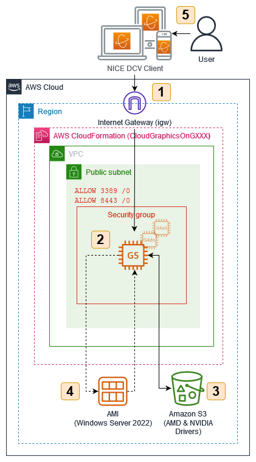

# Use Amazon EC2 for cost-efficient cloud gaming with pay-as-you-go pricing

This repository contains the full source code that is used in the blog post [Use Amazon EC2 for cost-efficient cloud gaming with pay-as-you-go pricing](https://aws.amazon.com/blogs/compute/use-amazon-ec2-for-cost-efficient-cloud-gaming-with-pay-as-you-go-pricing/).

## Solution Overview
<p align="center">
  
</p>

### Prerequisites

- An [AWS account](https://signin.aws.amazon.com/signin?redirect_uri=https%3A%2F%2Fportal.aws.amazon.com%2Fbilling%2Fsignup%2Fresume&client_id=signup)
- Installed and authenticated [AWS CLI](https://docs.aws.amazon.com/en_pv/cli/latest/userguide/cli-chap-install.html) (authenticate with an [IAM](https://docs.aws.amazon.com/IAM/latest/UserGuide/getting-started.html) user or an [AWS STS](https://docs.aws.amazon.com/STS/latest/APIReference/Welcome.html) Security Token)
- Installed and setup [AWS Cloud Development Kit (AWS CDK)](https://docs.aws.amazon.com/cdk/latest/guide/getting_started.html)
- Installed Node.js, TypeScript and git
- AWS EC2 KeyPair (.pem)


### Let’s get you started

#### 1. Make sure you completed the prerequisites above and cloned this repo.

```
git clone git@github.com:aws-samples/cloud-gaming-on-ec2-instances
```

#### 2. Open the repository in your preferred IDE and familiarize yourself with the structure of the project.

```
.
├── cdk             CDK code that defines the environment
└── img             Images used in this README
```


#### 3. Install dependencies

node.js dependencies are declared in a `package.json`. This project contains a `package.json` file in the `cdk` folder. 

Navigate into `cdk` folder it and run `npm install` 


#### 4. Configure your environment

Before you can deploy the stack, you need to review the config. Navigate to `cdk/bin/cloud-gaming-on-ec2.ts` and review / update the following parameters:

- `ACCOUNT`: The account id you want to deploy the stack in
- `REGION`: The region you want to deploy the stack in
- `NICE_DCV_DISPLAY_DRIVER_URL`: The download URL of the NICE DCV Virtual Display Driver for EC2. You can leave this unless the link is broken or you want to use a different version.
- `NICE_DCV_SERVER_URL`: The download URL of the NICE DCV Server. You can leave this unless the link is broken or you want to use a different version.
- `InstanceSize`: Sets the size of the EC2 Instance. Defaults to `g5.xlarge`, `g4dn.xlarge`, and `g4ad.xlarge` respectively. 
- `associateElasticIp`: Controls if an Elastic IP address will be created and added to the EC2 instance.
- `EC2_KEYPAIR_NAME`: The name of the EC2 key pair you will use to connect to the instance. Make sure to have access to the respective .pem file.
- `VOLUME_SIZE_GIB`: The size of the root EBS volume. Around 20 GB will be used for the Windows installation, the rest will be available for your software. Note: Some EC2 Instance Types include instance store which can be initalized. 
- `OPEN_PORTS`: Access from these ports will be allowed. Per default this will only allow access for NICE DCV on port 8443
- `ALLOW_INBOUND_CIDR`: Access from this CIDR range will be allowed. Per default this will allow access from /0, but I recommend to restrict this to your IP address only.
- `GRID_SW_CERT_URL`: (Only for g4dn/g5 instances) The NVIDIA driver requires a certificate file which can be downloaded from Amazon S3. You can leave this unless the link is broken or you want to use a different certificate.
- `tags`: A list of resource tags that will be added to every taggable resource in the stack.
- `SEVEN_ZIP_URL`: Update to the latest 7zip .msi version as it is required for the automated NVIDIA driver install. 
- `CHROME_URL`: Installs Google Chrome Enterprise x64.

#### 5. Deploy your application

The CDK code is written in TypeScript, an extension to JavaScript that adds static types and other useful features.

To run the CDK code, navigate to the `cdk` folder and run the following commands

```
cdk bootstrap
cdk deploy <StackName>
```

After bootstrapping the required resources for the CDK with `cdk bootstrap` you can then deploy the template with `cdk deploy <StackName>`. Bootstrapping is only require once.

`<StackName>` can be either `CloudGamingOnG4DN`, `CloudGamingOnG4AD` or `CloudGamingOnG5`, depending on the instance type you want to use.

The following table gives an overview over the expected graphics performance, expressed as 3DMark Time Spy scores.

| Instance Type | 3DMark Score | On-demand Price (us-east-1, USD, 02/23) | Price-performance (3DMark points / $) |
|--------------|--------------|-----------------------------------------|---------------------------------------|
| g4dn.xlarge  | 4300         | $0.71                                   | 6056                                  |
| g4dn.2xlarge | 4800         | $1.12                                   | 4286                                  |
| g4dn.4xlarge | 6000         | $1.94                                   | 3093                                  |
| g4ad.xlarge  | 5100         | $0.56                                   | 9107                                  |
| g4ad.2xlarge | 6600         | $0.91                                   | 7253                                  |
| g4ad.4xlarge | 7600         | $1.60                                   | 4750                                  |
| g5.xlarge    | 6800         | $1.19                                   | 5714                                  |
| g5.2xlarge   | 10200        | $1.58                                   | 6456                                  |
| g5.4xlarge   | 13000        | $2.36                                   | 5508                                  |


Stack completion usually takes `8-15` minutes.

#### 6. Create your personal gaming AMI

Follow the instructions in the associated blog post [Use Amazon EC2 for cost-efficient cloud gaming with pay-as-you-go pricing](https://aws.amazon.com/blogs/compute/use-amazon-ec2-for-cost-efficient-cloud-gaming-with-pay-as-you-go-pricing/).

## Useful CLI commands

List EC2 key pairs

```
aws ec2 describe-key-pairs --query 'KeyPairs[*].KeyName' --output table
```
Create a new key pair and the PEM file to store your private key
```
KEY_NAME=GamingOnEc2
aws ec2 create-key-pair --key-name $KEY_NAME --query 'KeyMaterial' --output text > $KEY_NAME.pem
```

Start / Stop an EC2 instance
```
aws ec2 start-instances --instance-ids INSTANCE_ID
aws ec2 stop-instances --instance-ids INSTANCE_ID
```

Creates an Amazon Machine Image from an EC2 instance
```
aws ec2 create-image --instance-id <YOUR_INSTANCE_ID> --name <THE_NAME_OF_YOUR_AMI>
```

Starts a new EC2 instance from a launch template
```
aws ec2 run-instances --image-id <YOUR_AMI_ID> --launch-template LaunchTemplateName=<LAUNCH_TEMPLATE_NAME> --query "Instances[*].[InstanceId, PublicIpAddress]" --output table
```

List your instances
```
aws ec2 describe-instances --query "Reservations[*].Instances[*].[ImageId, InstanceType, VpcId, State.Name, PublicIpAddress, LaunchTime]" --output table
```
Deploy all stacks at once, without rollback and dont require approval for IAM resources
```
cdk deploy --all --no-rollback --concurrency=3 --require-approval=never
```
List all stacks
```
cdk list
```

## Security

See [CONTRIBUTING](CONTRIBUTING.md#security-issue-notifications) for more information.

## License

This library is licensed under the MIT-0 License. See the LICENSE file.
